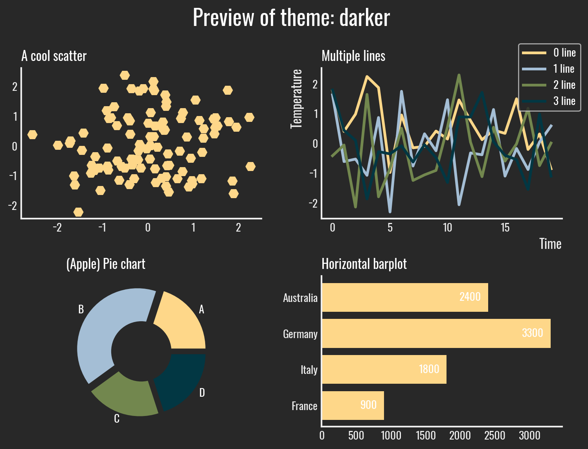

<!-- Automatically generated, do not change by hand. Use docs/script/gallery.py instead. -->


### Darker

My very first theme. I wanted to create something simple and a dark theme.

```python
import matplotlib.pyplot as plt
import morethemes as mt

mt.set_theme("darker")
```

<center></center>

<br>

### Yellowish

The background yellow comes from a nice National Geographic visualisation, and I think it looks pretty cool with the black and white visuals.

```python
import matplotlib.pyplot as plt
import morethemes as mt

mt.set_theme("yellowish")
```

<center></center>

<br>

### Urban

I wanted to make a theme that used the Urbanist font, with a clean professional look. And here it is.

```python
import matplotlib.pyplot as plt
import morethemes as mt

mt.set_theme("urban")
```

<center></center>

<br>

### Wsj

A theme inspired by the Wall Street Journal.

```python
import matplotlib.pyplot as plt
import morethemes as mt

mt.set_theme("wsj")
```

<center></center>

<br>

### Economist

A theme inspired by The Economist.

```python
import matplotlib.pyplot as plt
import morethemes as mt

mt.set_theme("economist")
```

<center></center>

<br>

### Minimal

A minimalist theme.

```python
import matplotlib.pyplot as plt
import morethemes as mt

mt.set_theme("minimal")
```

<center></center>

<br>
