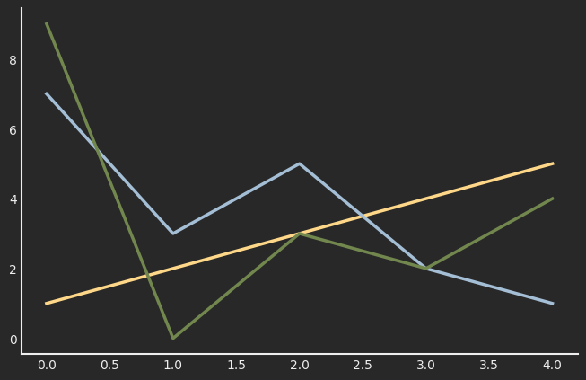

# `morethemes`: more themes for matplotlib

`morethemes` provides themes for [matplotlib](https://matplotlib.org/){:target="\_blank"}. One line of code. Great visualisations.

## Quick start

All you need is the `mt.set_theme()` function:

```py
import matplotlib.pyplot as plt
import morethemes as mt

mt.set_theme("darker")

fig, ax = plt.subplots(figsize=(8, 5))
ax.plot([1, 2, 3, 4, 5])
ax.plot([7, 3, 5, 2, 1])
ax.plot([9, 0, 3, 2, 4])
plt.show()
```

<center></center>

[View all themes](./gallery.md)

<br>

## Installation

Install from PyPI

```bash
pip install morethemes
```

Install the development version

```bash
pip install git+https://github.com/JosephBARBIERDARNAL/morethemes.git
```

<br>

## Theme finder

<div style="width: 100%; display: flex; justify-content: center; margin-top: 20px;">
    <iframe
        title="Tool to find a color palette for a python chart"
        style="width: 120%; height: 1800px;"
        src="https://holtzy.github.io/dataviz-color-finder/"
    ></iframe>
</div>

<br>

## Learn matplotlib

This project is sponsored by [Matplotlib Journey](https://www.matplotlib-journey.com/){:target="\_blank"}, an online course designed to make you a matplotlib expert. If you're interested in learning matplotlib, have a look!

<center>[Join the course :fontawesome-solid-paper-plane:](https://www.matplotlib-journey.com/){ .md-button .md-button--primary  }</center>
