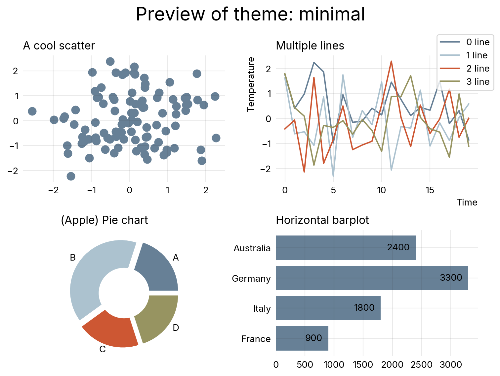
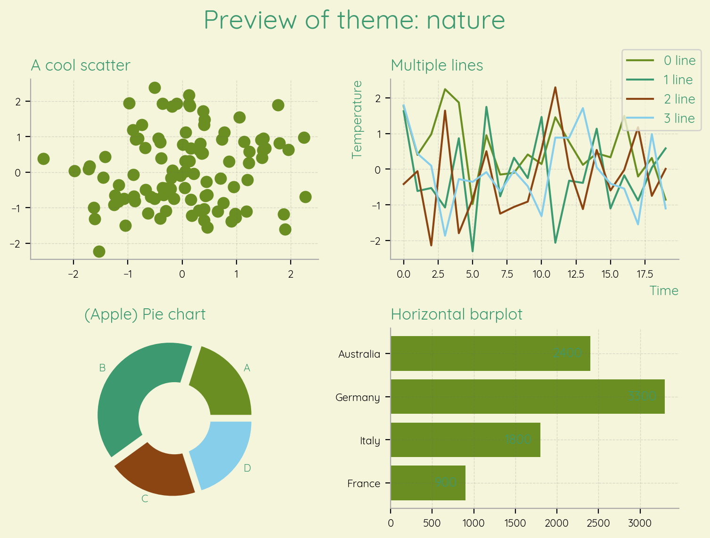
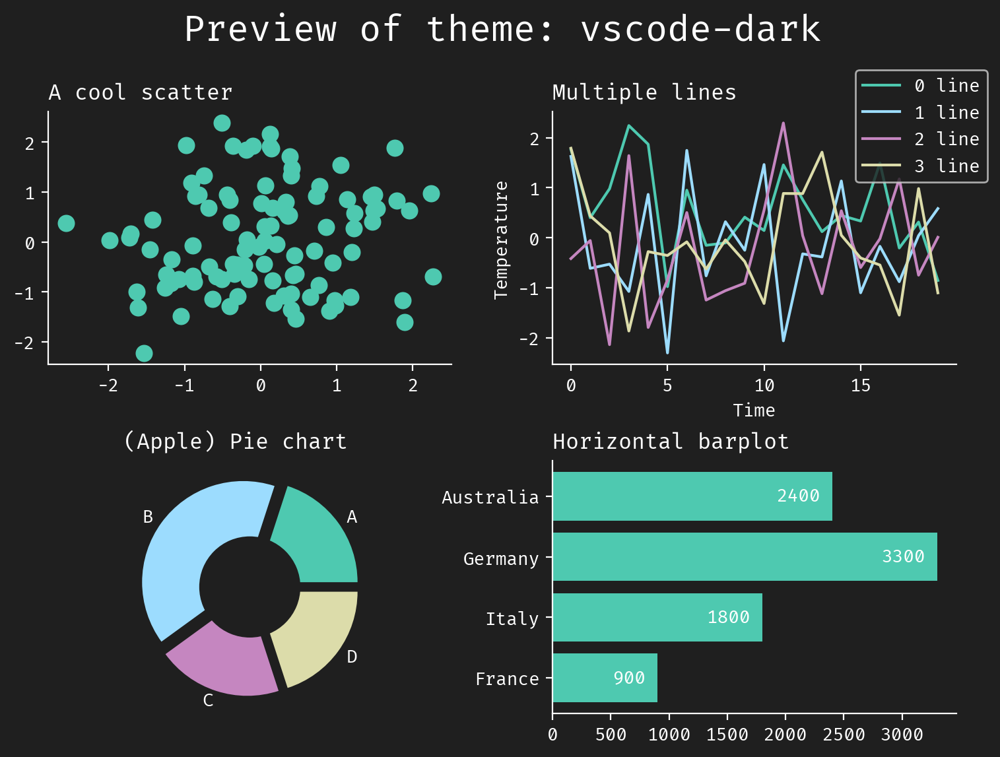

<!-- Automatically generated, do not change by hand. Use docs/index.qmd instead. -->

# `morethemes`: more themes for matplotlib


**`morethemes`** provides themes for
[matplotlib](https://matplotlib.org/). More themes, better plots, one
line of code.


<br>

## Themes

**`morethemes`** offers 10 themes at the moment:

=== "WSJ"

    

    ```python
    import morethemes as mt
    mt.set_theme("wsj")
    ```

    A refined, newspaper-style theme inspired by the Wall Street Journal.

=== "URBAN"

    

    ```python
    import morethemes as mt
    mt.set_theme("urban")
    ```

    A clean, professional theme featuring the Urbanist font and muted tones.

=== "MINIMAL"

    

    ```python
    import morethemes as mt
    mt.set_theme("minimal")
    ```

    A pure, distraction-free theme with a simple monochrome palette.

=== "FT"

    

    ```python
    import morethemes as mt
    mt.set_theme("ft")
    ```

    A sophisticated, no-nonsense theme with a muted palette and strong typographic clarity, echoing the Financial Times' aesthetic.

=== "NATURE"

    

    ```python
    import morethemes as mt
    mt.set_theme("nature")
    ```

    A calming theme inspired by natural landscapes, with earthy tones and organic shapes.

=== "ECONOMIST"

    

    ```python
    import morethemes as mt
    mt.set_theme("economist")
    ```

    A crisp, data-focused theme with subtle gridlines and sharp contrasts.

=== "RETRO"

    

    ```python
    import morethemes as mt
    mt.set_theme("retro")
    ```

    A nostalgic theme inspired by vintage graphics and retro gaming.

=== "YELLOWISH"

    

    ```python
    import morethemes as mt
    mt.set_theme("yellowish")
    ```

    A bold, National Geographic-inspired theme with a warm yellow backdrop

=== "DARKER"

    

    ```python
    import morethemes as mt
    mt.set_theme("darker")
    ```

    A sleek, no-frills dark theme with high contrast and a modern feel

=== "MONOBLUE"

    

    ```python
    import morethemes as mt
    mt.set_theme("monoblue")
    ```

    A high-contrast theme using shades of blue to emphasize data trends and maintain a clean, professional aesthetic.

=== "VSCODE-DARK"

    

    ```python
    import morethemes as mt
    mt.set_theme("vscode-dark")
    ```

    A dark theme inspired by Visual Studio Code's dark mode.

<br>

## Installation

``` bash
pip install morethemes
```

Don't want to add **`morethemes`** as a dependency? You can either
browse the [source
code](https://github.com/JosephBARBIERDARNAL/morethemes/blob/main/morethemes/themes.py)
to find the rcParams, or use the `mt.get_rcparams("theme_name")`
function.
