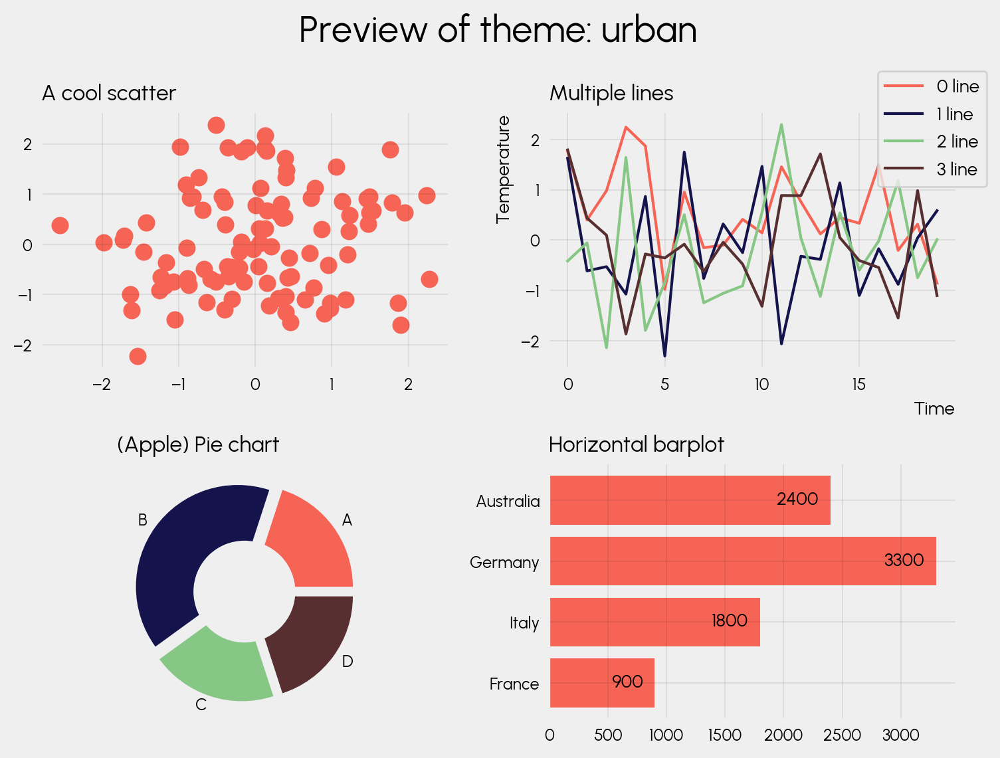
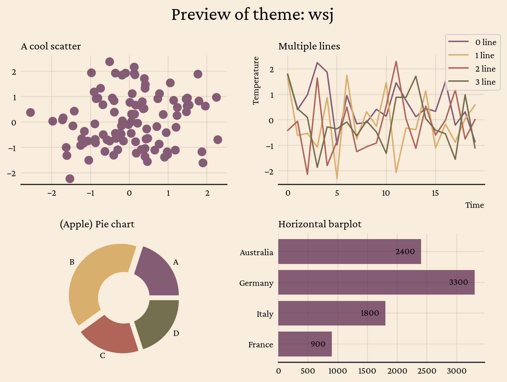

<!-- Automatically generated, do not change by hand. Use docs/script/make.py instead. -->

# `morethemes`: more themes for matplotlib

`morethemes` provides themes for [matplotlib](https://matplotlib.org/). More themes, better plots. One line of code.

<br>

## Themes


=== "Darker"

    

    ```python
    import morethemes as mt
    mt.set_theme("darker")
    ```

    A sleek, no-frills dark theme with high contrast and a modern feel Made by Joseph Barbier.

    
=== "Yellowish"

    

    ```python
    import morethemes as mt
    mt.set_theme("yellowish")
    ```

    A bold, National Geographic-inspired theme with a warm yellow backdrop Made by Joseph Barbier.

    
=== "Urban"

    

    ```python
    import morethemes as mt
    mt.set_theme("urban")
    ```

    A clean, professional theme featuring the Urbanist font and muted tones. Made by Joseph Barbier.

    
=== "WSJ"

    

    ```python
    import morethemes as mt
    mt.set_theme("wsj")
    ```

    A refined, newspaper-style theme inspired by the Wall Street Journal. Made by Joseph Barbier.

    
=== "Economist"

    

    ```python
    import morethemes as mt
    mt.set_theme("economist")
    ```

    A crisp, data-focused theme with subtle gridlines and sharp contrasts. Made by Joseph Barbier.

    
=== "Minimal"

    

    ```python
    import morethemes as mt
    mt.set_theme("minimal")
    ```

    A pure, distraction-free theme with a simple monochrome palette. Made by Joseph Barbier.

    
    
<br>

## Installation

```bash
pip install morethemes
```
    

<br>

## Learn matplotlib

This project is sponsored by [Matplotlib Journey](https://www.matplotlib-journey.com/){:target="\_blank"}, an online course designed to make you a matplotlib expert. If you're interested in learning matplotlib, have a look!

<center>[Join the course :fontawesome-solid-paper-plane:](https://www.matplotlib-journey.com/){ .md-button .md-button--primary  }</center>

<br>
    